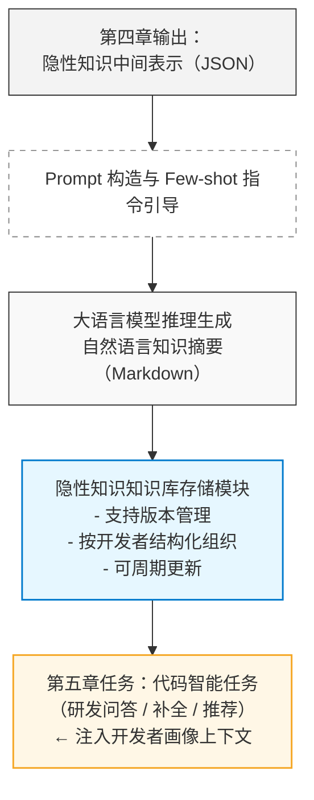

```mermaid
flowchart TD
    A[第四章输出：<br/>隐性知识中间表示（JSON）] --> B[Prompt 构造与 Few-shot 指令引导]
    B --> C[大语言模型推理生成<br/>自然语言知识摘要（Markdown）]
    C --> D[隐性知识知识库存储模块<br/>- 支持版本管理<br/>- 按开发者结构化组织<br/>- 可周期更新]
    D --> E[第五章任务：代码智能任务<br/>（研发问答 / 补全 / 推荐）<br/>← 注入开发者画像上下文]

    style A fill:#f3f3f3,stroke:#333,stroke-width:1px
    style B fill:#ffffff,stroke:#888,stroke-width:1px,stroke-dasharray: 5 5
    style C fill:#f9f9f9,stroke:#333,stroke-width:1px
    style D fill:#e6f7ff,stroke:#007acc,stroke-width:1.5px
    style E fill:#fff7e6,stroke:#f5a623,stroke-width:1.5px

```
